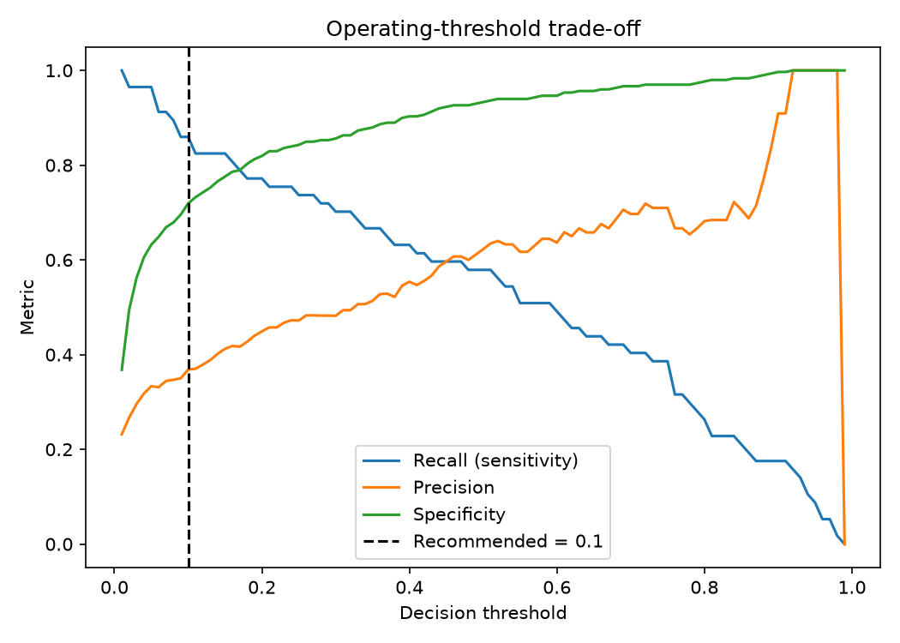

# ICU Mortality Prediction — Clinical Risk, Evidence RAG & Agent

🔗 **[Live demo]([https://icu-mortality-prediction.streamlit.app](https://icu-mortality-prediction-r7htks4wtyq38jcmfhi7ef.streamlit.app/))** · [Repository](https://github.com/GustavoSimoesFerreira/icu-mortality-prediction)

An end-to-end, **100% free and local** healthcare-AI project with three pillars:

1. a **predictive risk model** for 28-day ICU mortality (interpretability,
   calibration, cross-validated tuning, a fairness audit, and clinical
   threshold selection);
2. a **RAG evidence assistant** that answers clinical questions from real PubMed
   literature, with inline citations and a groundedness evaluation; and
3. an **agentic workflow** in which a local LLM autonomously calls the risk
   model and the evidence assistant to write a cited clinical summary.

An interactive **Streamlit demo** ties all three together. The project covers
classic predictive modeling *and* modern GenAI (LLMs, retrieval-augmented
generation, semantic search, agentic tool calling) — using only open data and
locally-run models.

> ⚠️ **Research / portfolio use only.** Not a medical device and not clinical
> advice. Tabular data is the **Open Access** PhysioNet Indwelling Arterial
> Catheter dataset (de-identified). No patient data is committed to this repo.


---

## Table of Contents
- [What's inside](#whats-inside)
- [Skills demonstrated](#skills-demonstrated)
- [Architecture](#architecture)
- [Data Sources](#data-sources)
- [Tech Stack (free & local)](#tech-stack-free--local)
- [Results](#results)
- [Responsible AI & Governance](#responsible-ai--governance)
- [Project Structure](#project-structure)
- [Getting Started](#getting-started)
- [Roadmap](#roadmap)
- [Limitations](#limitations)
- [License & Attribution](#license--attribution)

## What's inside

**1. Risk model — 28-day ICU mortality.** A logistic-regression baseline and an
XGBoost model trained on de-identified ICU data, with median/most-frequent
imputation, patient-level train/test splitting, SHAP explanations, calibration
analysis, a subgroup fairness audit, cross-validated hyperparameter tuning, and
explicit operating-threshold selection.

**2. Evidence assistant — clinical RAG.** Fetches abstracts from PubMed, embeds
and indexes them locally, retrieves the most relevant passages for a question,
and asks a **local LLM (Ollama)** to answer *with inline citations*. A
groundedness evaluation checks whether answers are actually supported by the
retrieved sources.

**3. Agentic workflow.** Given a patient, the LLM autonomously decides to call
the risk model (to get the predicted risk and its top drivers) and the evidence
assistant (to find literature on the main driver), then writes a concise, cited
clinical summary — orchestration handled via Ollama tool calling.

**Interactive demo.** A Streamlit app exposes all three: pick a patient, see the
risk with a SHAP explanation and an adjustable decision threshold, query the
evidence assistant, and run the agent. It is **hybrid** — fully live when Ollama
is running locally, and it degrades gracefully to pre-generated examples when
hosted without a local LLM.

## Skills demonstrated

| Area | In this project |
|------|-----------------|
| Predictive modeling | Logistic regression + XGBoost on real-world clinical data |
| Imbalanced evaluation | AUROC, **AUPRC**, Brier score, calibration curves |
| Hyperparameter tuning | Randomized search with stratified cross-validation |
| Interpretability | SHAP (feature attributions), per-patient explanations |
| Decision science | Operating-threshold selection for a clinical recall target |
| Responsible AI | Subgroup fairness audit; leakage control; governance notes |
| GenAI / LLMs | Retrieval-augmented generation with a locally-run LLM |
| Semantic search | Embedding-based retrieval over a PubMed corpus |
| Agentic AI | Multi-step LLM tool calling orchestrating model + retrieval |
| Model evaluation | Groundedness / faithfulness scoring of generated answers |
| Engineering | Config-driven, tested (pytest), linted (ruff), CI, Streamlit demo |

## Architecture

```
  PhysioNet ICU data - preprocessing - LogReg / XGBoost - SHAP + calibration
  (Open Access)        (impute, split)  (CV-tuned)      |- fairness audit
                                                        |- threshold analysis

  PubMed abstracts - chunk - embed (Ollama) - vector store - retrieve top-k
  (E-utilities)                                                   |
                                          local LLM (Ollama) - cited answer
                                                                  |- groundedness eval

  Agent - [tool] get_patient_risk --,
          [tool] search_evidence  --+- local LLM writes a cited clinical summary

  Streamlit demo - risk + SHAP + threshold | evidence assistant | agent
```

## Data Sources

| Purpose | Source | Access |
|---------|--------|--------|
| Tabular ICU data | **PhysioNet Indwelling Arterial Catheter** (`mimic2-iaccd`) | **Open** (ODC-By) — 1,776 patients, no credentialing |
| RAG corpus | **PubMed** abstracts (NCBI E-utilities) | Open API |

> No patient data is committed. The PhysioNet CSV is downloaded on demand into
> gitignored `data/`; the PubMed index is built locally.

## Tech Stack (free & local)

Everything runs on your machine at **zero cost** — no paid APIs, no cloud bills.
Running the LLM locally also means no data leaves the machine.

| Layer | Tool | Cost |
|-------|------|------|
| Modeling & tuning | scikit-learn, XGBoost | Free |
| Interpretability | SHAP | Free |
| LLM (RAG + agent) | Ollama + qwen2.5 (+ nomic-embed-text) | Free, local |
| Vector search | numpy (cosine similarity) — swappable for Chroma/FAISS | Free |
| Data / HTTP | pandas, pyarrow, requests | Free |
| Demo | Streamlit | Free |
| Dev | pytest, ruff, GitHub Actions | Free |

## Results

Trained on the PhysioNet IAC dataset (1,776 ICU patients, **15.9%** 28-day
mortality), evaluated on a held-out test set. XGBoost hyperparameters were chosen
by randomized search with 5-fold stratified cross-validation, optimizing **F1**
(CV F1 ~ 0.54 +/- 0.06) to balance recall and precision on the imbalanced outcome.

| Model | AUROC | AUPRC | Brier ↓ | Recall | Precision |
|-------|-------|-------|---------|--------|-----------|
| Logistic Regression | 0.90 | 0.65 | 0.127 | 0.84 | 0.46 |
| **XGBoost** (F1-tuned) | 0.89 | 0.63 | 0.095 | 0.58 | 0.62 |

**XGBoost was selected despite a marginally lower AUROC**, because its
probabilities are better calibrated (lower Brier score). In clinical decision
support, a predicted risk of 40% needs to *mean* 40%, not merely rank patients.


**Interpretability (SHAP).** The top drivers are all legitimate ICU mortality
predictors — patient age, stroke, severity scores (SAPS I, SOFA), fluid
administration, and inflammatory labs (WBC). No outcome-derived feature appears,
supporting that the AUROC reflects real signal, not leakage.

**Fairness audit.** Performance is fairly consistent across age after tuning
(AUROC 0.76–0.83 for most groups), with the oldest patients (age 85+: 0.65)
remaining the weakest subgroup — expected, given only 28 such patients. Sexes
are balanced (0.88 vs 0.88). Notably, F1-based tuning also improved the youngest
group (age <40) from 0.44 to 0.77. This limitation is reported, not hidden.

**Operating threshold.** The model outputs probabilities, so the decision
threshold is a separate, deliberate choice. Because a missed death costs more
than a false alarm, we favour higher-recall operating points and present two,
against the default as a baseline:

| Threshold | Recall | Precision | Specificity | Best suited for |
|-----------|--------|-----------|-------------|-----------------|
| 0.50 (default baseline) | 0.58 | 0.62 | 0.93 | Off-the-shelf cut-off — misses 42% of deaths, so not ideal for a mortality screen |
| 0.15 (balanced)         | 0.82 | 0.41 | 0.78 | Keeping high recall while limiting false alarms, when the triggered action is more costly |
| 0.10 (max sensitivity)  | 0.86 | 0.37 | 0.72 | Catching the most deaths when the triggered action is low-cost (e.g. a nursing re-check) |



Moving from the default 0.50 to 0.10 raises the share of ICU deaths caught from
58% to 86%, at the cost of lower precision. This separates model *quality* from
the operating-point *decision* — a clinical judgement about the relative cost of
false negatives vs false positives.

**Evidence assistant (RAG).** Example — *"What clinical scores predict ICU
mortality?"* returns a cited answer naming APACHE II, SAPS III, SOFA, SAPS II and
OASIS, each tied to a specific PubMed source. A groundedness evaluation over
sample questions averaged **0.70** — and correctly flagged a low score on a
question whose answer the corpus did not fully support, demonstrating the
evaluation catches unsupported (hallucinated) content.

**Agent.** For a given patient, the agent calls the risk model, identifies the
main driver, retrieves supporting PubMed evidence for it, and produces a short
cited summary — e.g. a low-risk patient whose main driver is an elevated
admission pCO2, with the literature link explaining the association [1].

## Responsible AI & Governance

- **Fairness audit** across age and sex subgroups (race is not in this dataset).
- **Interpretability:** SHAP for the risk model; inline source citations for RAG.
- **Leakage control:** patient-level split; outcome/censoring columns excluded
  from features.
- **Local-only LLM:** embeddings and generation run on Ollama, so no data is
  sent to third-party LLM services — a good practice reinforced by PhysioNet's
  responsible-use guidance.
- **Privacy:** de-identified Open Access data; no PHI committed.

## Project Structure

```
icu-mortality-prediction/
├── configs/            # data.yaml, model.yaml, tune.yaml, threshold.yaml, rag.yaml, agent.yaml
├── data/               # (gitignored) downloaded data + RAG index
├── models/             # (gitignored) cached trained pipeline
├── reports/figures/    # SHAP, calibration, threshold plots
├── src/
│   ├── data/           # dataset loading & exploration
│   ├── features/       # preprocessing (impute, encode, patient-level split)
│   ├── models/         # training (LogReg + XGBoost) and CV tuning
│   ├── evaluation/     # metrics, fairness audit, threshold analysis
│   ├── explain/        # SHAP
│   ├── rag/            # PubMed + Ollama evidence assistant
│   └── agent/          # agentic workflow (risk model + RAG orchestration)
├── app/                # Streamlit demo (streamlit_app.py, demo_utils.py)
├── tests/              # offline unit tests
├── .github/workflows/  # CI (lint + tests)
├── requirements.txt
└── README.md
```

## Getting Started

```bash
# Setup
python -m venv .venv && source .venv/bin/activate   # Windows: .venv\Scripts\Activate.ps1
pip install -r requirements.txt

# 1. Load the ICU dataset (auto-downloads from PhysioNet, then caches)
python -m src.data.load_diabetes --config configs/data.yaml

# 2. Train & evaluate the risk model (LogReg + XGBoost, SHAP, calibration, fairness)
python -m src.models.train --config configs/model.yaml

# 3. (Optional) Tune hyperparameters with cross-validation
python -m src.models.tune --config configs/model.yaml --tune-config configs/tune.yaml

# 4. (Optional) Choose an operating threshold for a target recall
python -m src.evaluation.threshold_analysis --config configs/model.yaml \
    --threshold-config configs/threshold.yaml
```

**For the RAG assistant and agent**, install [Ollama](https://ollama.com/download)
and pull the models once:

```bash
ollama pull nomic-embed-text     # embeddings
ollama pull qwen2.5              # generation + tool calling

# 5. Build the PubMed index, then ask questions
python -m src.rag.ingest   --config configs/rag.yaml
python -m src.rag.ask      --config configs/rag.yaml --question "What predicts ICU mortality?"
python -m src.rag.evaluate --config configs/rag.yaml

# 6. Run the agent for a patient (orchestrates the model + evidence retrieval)
python -m src.agent.run --config configs/agent.yaml --patient 0
```

**Interactive demo:**

```bash
streamlit run app/streamlit_app.py
```

> The agent and RAG use **qwen2.5** (via Ollama) because it handles multi-step
> tool calling more reliably than smaller local models.
> Set your contact email in `configs/rag.yaml` (`pubmed.email`) before ingesting —
> NCBI requests it.

## Roadmap

- [x] Data loading & exploration
- [x] Risk model (LogReg + XGBoost) with SHAP, calibration, fairness
- [x] Cross-validated hyperparameter tuning
- [x] Operating-threshold analysis for a clinical recall target
- [x] RAG evidence assistant with groundedness evaluation
- [x] Agentic workflow tying the risk model + evidence retrieval into a summary
- [x] Streamlit demo (hybrid: live locally, graceful fallback when hosted)

## Limitations

- The cohort is small (~1,776 patients) and single-center ICU data — results
  illustrate methodology, not generalizable performance.
- RAG answer quality depends on corpus coverage; the groundedness score exposes
  when a question isn't well supported.
- Local LLM tool calling can occasionally be imperfect; the agent guards against
  malformed calls but quality depends on the chosen model.
- Not validated for clinical use; **research/educational only**.

## License & Attribution

Code released under the **MIT License** (see `LICENSE`).

The PhysioNet Indwelling Arterial Catheter dataset is licensed **ODC-By** and
requires attribution: Raffa, J. (2016), *Clinical data from the MIMIC-II
database for a case study on indwelling arterial catheters*, PhysioNet.
