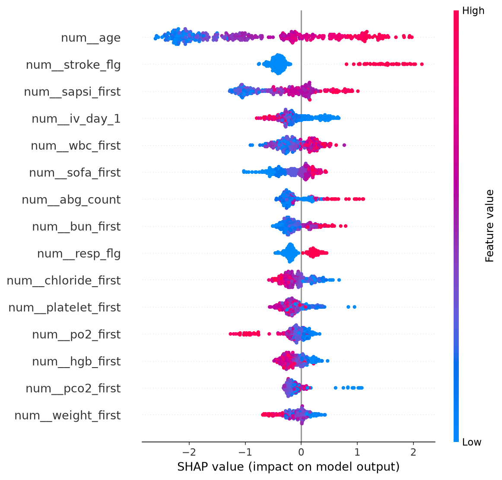
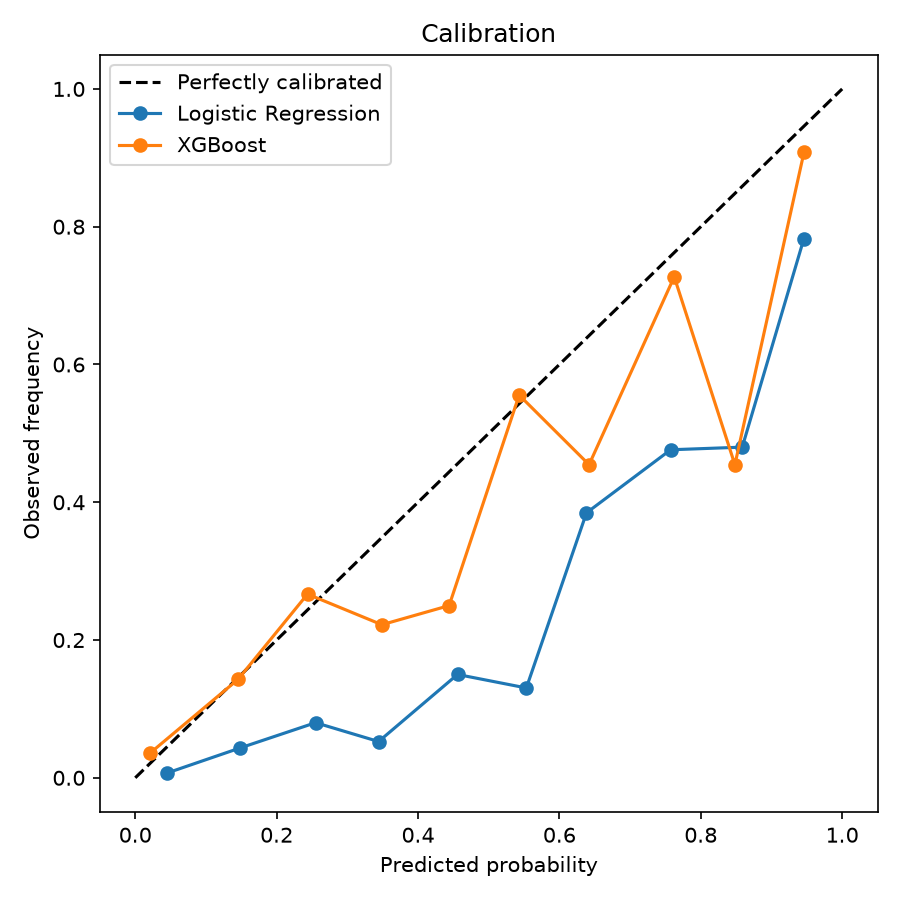

# ICU Mortality Prediction & Clinical Evidence Assistant

An end-to-end, **100% free and local** healthcare-AI project with two pillars:

1. a **predictive risk model** for 28-day ICU mortality (with interpretability,
   calibration, and a fairness audit), and
2. a **RAG evidence assistant** that answers clinical questions from real PubMed
   literature, with citations and a groundedness evaluation.

Together they cover both classic predictive modeling and modern GenAI (LLMs,
retrieval-augmented generation, semantic search) — using only open data and
locally-run models.

> ⚠️ **Research / portfolio use only.** Not a medical device and not clinical
> advice. Tabular data is the **Open Access** PhysioNet Indwelling Arterial
> Catheter dataset (de-identified). No patient data is committed to this repo.


---

## Table of Contents
- [What's inside](#whats-inside)
- [Skills demonstrated](#skills-demonstrated)
- [Architecture](#architecture)
- [Data Sources](#data-sources)
- [Tech Stack (free & local)](#tech-stack-free--local)
- [Results](#results)
- [Responsible AI & Governance](#responsible-ai--governance)
- [Project Structure](#project-structure)
- [Getting Started](#getting-started)
- [Roadmap](#roadmap)
- [Limitations](#limitations)
- [License & Attribution](#license--attribution)

## What's inside

**1. Risk model — 28-day ICU mortality.** A logistic-regression baseline and an
XGBoost model trained on de-identified ICU data, with median/most-frequent
imputation, patient-level train/test splitting, SHAP explanations, a calibration
analysis, and a subgroup fairness audit.

**2. Evidence assistant — clinical RAG.** Fetches abstracts from PubMed, embeds
and indexes them locally, retrieves the most relevant passages for a question,
and asks a **local LLM (Ollama)** to answer *with inline citations*. A
groundedness evaluation checks whether answers are actually supported by the
retrieved sources.

## Skills demonstrated

| Area | In this project |
|------|-----------------|
| Predictive modeling | Logistic regression + XGBoost on real-world clinical data |
| Imbalanced evaluation | AUROC, **AUPRC**, Brier score, calibration curves |
| Interpretability | SHAP (feature attributions) |
| Responsible AI | Subgroup fairness audit; leakage control; governance notes |
| GenAI / LLMs | Retrieval-augmented generation with a locally-run LLM |
| Semantic search | Embedding-based retrieval over a PubMed corpus |
| Model evaluation | Groundedness / faithfulness scoring of generated answers |
| Engineering | Config-driven, tested (pytest), linted (ruff), CI on GitHub Actions |

## Architecture

```
  PhysioNet ICU data ──▶ preprocessing ──▶ LogReg / XGBoost ──▶ SHAP + calibration
  (Open Access)          (impute, split)                    └─▶ fairness audit
                                                                       │
                                                                       ▼
                                                                 metrics + figures

  PubMed abstracts ──▶ chunk ──▶ embed (Ollama) ──▶ vector store ──▶ retrieve top-k
  (E-utilities)                                                            │
                                                                           ▼
                                                    local LLM (Ollama) ──▶ cited answer
                                                                           │
                                                                           ▼
                                                                 groundedness eval
```

## Data Sources

| Purpose | Source | Access |
|---------|--------|--------|
| Tabular ICU data | **PhysioNet Indwelling Arterial Catheter** (`mimic2-iaccd`) | **Open** (ODC-By) — 1,776 patients, no credentialing |
| RAG corpus | **PubMed** abstracts (NCBI E-utilities) | Open API |

> No patient data is committed. The PhysioNet CSV is downloaded on demand into
> gitignored `data/`; the PubMed index is built locally.

## Tech Stack (free & local)

Everything runs on your machine at **zero cost** — no paid APIs, no cloud bills.
Running the LLM locally also means no data leaves the machine.

| Layer | Tool |
|-------|------|
| Modeling | scikit-learn, XGBoost |
| Interpretability | SHAP |
| LLM (RAG + agent) | Ollama + an open model (Llama / Mistral / Qwen) | Free, local |
| Vector search | numpy (cosine similarity) — swappable for Chroma/FAISS |
| Data / HTTP | pandas, pyarrow, requests |
| Dev | pytest, ruff, GitHub Actions |

## Results

Trained on the PhysioNet IAC dataset (1,776 ICU patients, **15.9%** 28-day
mortality), evaluated on a held-out test set.

| Model | AUROC | AUPRC | Brier ↓ | Recall | Precision |
|-------|-------|-------|---------|--------|-----------|
| Logistic Regression | 0.90 | 0.65 | 0.127 | 0.84 | 0.46 |
| **XGBoost** (F1-tuned) | 0.89 | 0.63 | 0.095 | 0.58 | 0.62 |

**XGBoost was selected despite a marginally lower AUROC**, because its
probabilities are better calibrated (lower Brier score). In clinical decision
support, a predicted risk of 40% needs to *mean* 40%, not merely rank patients.




**Interpretability (SHAP).** The top drivers are all legitimate ICU mortality
predictors — patient age, stroke, severity scores (SAPS I, SOFA), fluid administration,
and inflammatory labs (WBC). No outcome-derived feature appears, supporting that the
AUROC reflects real signal, not leakage.

**Fairness audit.** Performance is fairly consistent across age after tuning
(AUROC 0.76–0.83 for most groups), with the oldest patients (age 85+: 0.65)
remaining the weakest subgroup — expected, given only 28 such patients. Sexes
are balanced (0.88 vs 0.88). Notably, F1-based tuning also improved the youngest
group (age <40) from 0.44 to 0.77. This limitation is reported, not hidden.

**Evidence assistant (RAG).** Example — *"What clinical scores predict ICU
mortality?"* returns a cited answer naming APACHE II, SAPS III, SOFA, SAPS II and
OASIS, each tied to a specific PubMed source. A groundedness evaluation over
sample questions averaged **0.70** — and correctly flagged a low score on a
question whose answer the corpus did not fully support, demonstrating the
evaluation catches unsupported (hallucinated) content.

## Responsible AI & Governance

- **Fairness audit** across age and sex subgroups (race is not in this dataset).
- **Interpretability:** SHAP for the risk model; inline source citations for RAG.
- **Leakage control:** patient-level split; outcome/censoring columns excluded
  from features.
- **Local-only LLM:** embeddings and generation run on Ollama, so no data is
  sent to third-party LLM services — consistent with PhysioNet's responsible-use
  policy for restricted data.
- **Privacy:** de-identified Open Access data; no PHI committed.

## Project Structure

```
icu-mortality-prediction/
├── configs/            # data.yaml, model.yaml, rag.yaml
├── data/               # (gitignored) downloaded data + RAG index
├── reports/figures/    # SHAP + calibration plots
├── src/
│   ├── data/           # dataset loading & exploration
│   ├── features/       # preprocessing (impute, encode, patient-level split)
│   ├── models/         # training: LogReg + XGBoost
│   ├── evaluation/     # metrics + fairness audit
│   ├── explain/        # SHAP
│   └── rag/            # PubMed + Ollama evidence assistant
├── tests/              # offline unit tests
├── .github/workflows/  # CI (lint + tests)
├── requirements.txt
└── README.md
```

## Getting Started

```bash
# Setup
python -m venv .venv && source .venv/bin/activate   # Windows: .venv\Scripts\Activate.ps1
pip install -r requirements.txt

# 1. Load the ICU dataset (auto-downloads from PhysioNet, then caches)
python -m src.data.load_diabetes --config configs/data.yaml

# 2. Train & evaluate the risk model (LogReg + XGBoost, SHAP, fairness)
python -m src.models.train --config configs/model.yaml
```

**For the RAG assistant**, install [Ollama](https://ollama.com/download) and pull
the models once:

```bash
ollama pull nomic-embed-text
ollama pull qwen2.5

# 3. Build the PubMed index, then ask questions
python -m src.rag.ingest   --config configs/rag.yaml
python -m src.rag.ask      --config configs/rag.yaml --question "What predicts ICU mortality?"
python -m src.rag.evaluate --config configs/rag.yaml
```

> The agent uses **qwen2.5** (via Ollama) because it handles multi-step tool
> calling more reliably than smaller local models.
> Set your contact email in `configs/rag.yaml` (`pubmed.email`) before ingesting —
> NCBI requests it.

## Roadmap

- [x] Data loading & exploration
- [x] Risk model (LogReg + XGBoost) with SHAP, calibration, fairness
- [x] RAG evidence assistant with groundedness evaluation
- [ ] Agentic workflow tying the risk model + evidence retrieval into one report
- [ ] Streamlit demo deployed to Hugging Face Spaces

## Limitations

- The cohort is small (~1,776 patients) and single-center ICU data — results
  illustrate methodology, not generalizable performance.
- RAG answer quality depends on corpus coverage; the groundedness score exposes
  when a question isn't well supported.
- Not validated for clinical use; **research/educational only**.

## License & Attribution

Code released under the **MIT License** (see `LICENSE`).

The PhysioNet Indwelling Arterial Catheter dataset is licensed **ODC-By** and
requires attribution: Raffa, J. (2016), *Clinical data from the MIMIC-II
database for a case study on indwelling arterial catheters*, PhysioNet.